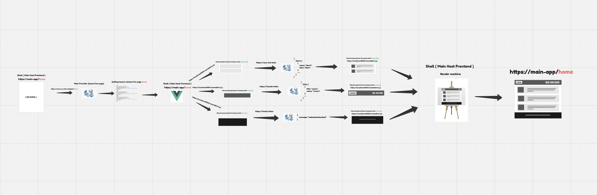
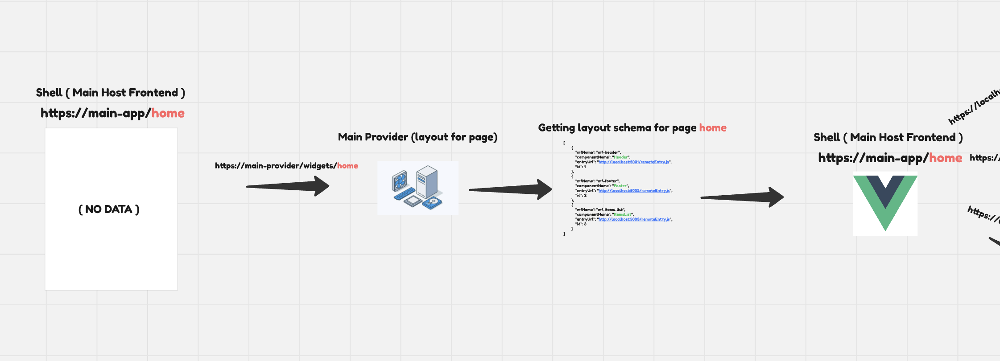
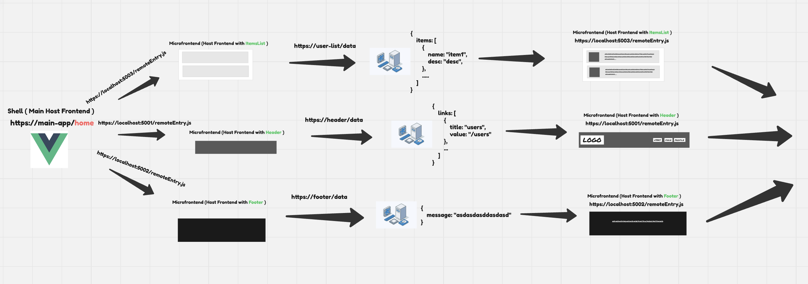
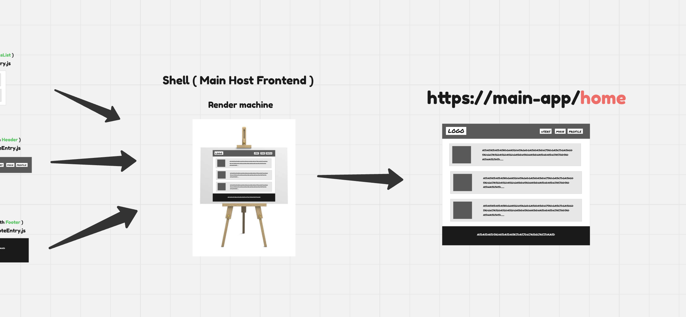

# Server-Driven-MIcro-Frontends UI

Server-Driven Micro-Frontends UI — это подход к построению интерфейса, при котором сервер решает, какие виджеты показать на странице, а клиент (хост) только загружает и рендерит их. Каждый виджет — это независимый микрофронтенд, который может иметь собственный микросервис (бэкенд), отвечающий за его данные и логику.

### Запуск всего приложения

```bash
make app-start
```

### Дока по проекту

[Инструкция по запуску и использованию микрофронтов приложения](./frontend-widgets/microfrontends.md)

[Инструкция по запуску и использованию микросервисов приложения](./backend-services/microservices.md)

### Работа приложения





